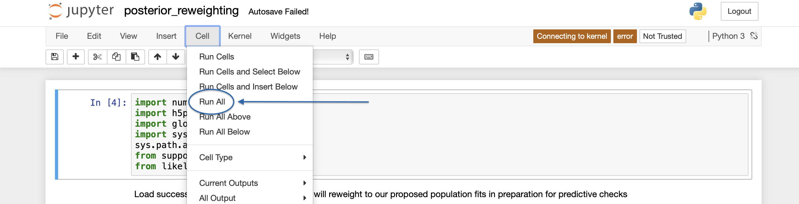

Figure Generation
=================

Code to generate the figures and Latex macros included in our paper text is included in the folder :file:`BBH-spin-q-correlations/figures/`.
In particular, these results are obtained by opening and running the following three Jupyter notebooks [1]_, which we will discuss in turn below:

* :file:`posterior_reweighting.ipynb`
* :file:`make_figures.ipynb`
* :file:`make-macros.ipynb`

Precomputing reweighted posteriors
----------------------------------

Several figures in the paper involve showing *reweighted posteriors*, single-event measurements from which we have removed the default prior and applied a new, population-informed prior.
Other figures involve *predictice checks*, in which we compare observed data with *expected data* if a given population model is correct.
Computing reweighted posteriors and/or predicted detections is a semi-involved process, involving a loop over our hyperparameter samples and a random downsamping of single-event posteriors according to new population-informed weights.
To minimize the work that's done in the actual plotting notebook (:file:`make_figures.ipynb`), we use :file:`posterior_reweighting.ipynb` to pre-compute and save much of this data in advance.

Open this notebook,

.. code-block:: bash

    $ jupyter notebook posterior_reweighting.ipynb

and run all cells,

to produce the following files:

* :file:`reweighted_samples_noEvolution.npy`

    Reweighted single-event effective spin and mass ratio measurements, according to the :code:`logp_powerLawPeak_noEvol` likelihood model discussed in :ref:`Likelihood definitions`.
    Measurements are stored in a dictionary:

    .. code-block:: python

        >>> import numpy as np
        >>> dict = np.load('reweighted_samples_noEvolution.npy',allow_pickle=True)[()]
        >>> dict.keys()
        dict_keys(['mock_q', 'mock_chi', 'resampled_q', 'resampled_chi'])

    where :code:`dict['resampled_q']` and :code:`dict['resampled_chi']` are each :code:`(n,m)` arrays containing reweighted mass ratio and effective spin samples, respectively.
    Here, :code:`n` is the number of BBH events in our catalog and :code:`m` the number of reweighted posterior samples for each event.
    Each of these :code:`m` samples is conditioned on a different random draw from our posterior on the population-level parameters measured in our analysis.
    Meanwhile, :code:`dict['mock_q']` and :code:`dict['mock_chi']` are :code:`(n,m)` arrays containing a sequence of mock observed catalogs, each with :code:`n` events, corresponding to our :code:`m` random draws from our population-level posteriors.
    Note that these mock catalogs *include* the impact of selection effects.

* :file:`reweighted_samples_yesEvolution.npy`

    As above, but using the :code:`logp_powerLawPeak` likelihood model that includes the possibility of spin and mass ratio correlations.

* :file:`reweighted_samples_yesEvolution_no190412.npy`

    Same as above, but using results obtained when excluding GW190412.

* :file:`reweighted_samples_yesEvolution_w190814.npy`

    Same as above, but using results obtained when *including* GW190814

* :file:`injection_samples_reweightedToIsotropy.npy`

    This file contains reweighted parameter estimation samples from the mock injection study described in :ref:`Mock Population Study`.
    When performing parameter estimation on our simulated signals, we assume purely *aligned* component spins, with a prior that is uniform on spin magnitude.
    The fiducial parameter estimation samples released by the LIGO-Virgo Collaboration for GWTC-2, meanwhile, adopt a prior that is uniform in spin magnitude but *isotropic in spin orientation* [2]_.
    These choices correspond to different implicit priors on :math:`\chi_\mathrm{eff}` and hence these two sets of results cannot be automatically compared in an apples-to-apples way.

    To allow a direct comparison (e.g. between Figs. 1a and 9a in the paper text), this file contains parameter estimation samples that have been reweighted to the *same* implicit :math:`\chi_\mathrm{eff}` prior that appears in the LIGO/Virgo results.
    Samples are accessed as a dictionary, with numbered keys that label each of our simulated signals:

    .. code-block:: python

        >>> import numpy as np
        >>> reweighted_injection_samps = np.load('injection_samples_reweightedToIsotropy.npy',allow_pickle=True)[()]
        >>> reweighted_injection_samps.keys()
        dict_keys([0, 1, 2, 3, 4, 5, 6, 7, 8, 9, 10, 11, 12, 13, 14, 15, 16, 17, 18, 19, 20, 21, 22, 23, 24, 25, 26, 27, 28, 29, 30, 31, 32, 33, 34, 35, 36, 37, 38, 39, 40, 41, 42, 43, 44, 45, 46, 47, 48, 49])

    Each event key, in turn, leads to another dictionary containing mass ratio (:code:`q`) and effective spin (:code:`x`) samples:

    .. code-block:: python

        >>> reweighted_injection_samps[5].keys()
        dict_keys(['q', 'x'])
        >>>
        >>> reweighted_injection_samps[5]['q']
        array([0.82542427, 0.5812419 , 0.77971792, ..., 0.8653652 , 0.55416062,
               0.79111037])
        >>>
        >>> reweighted_injection_samps[5]['x']
        array([ 0.01672742,  0.06527243, -0.1468124 , ...,  0.02260662,
               -0.04104319, -0.04593011])

Making figures
--------------

With most of the necessary data precomputed, generating figures is as simple as opening the notebook :code:`make_figures.ipynb` and running all cells.
Doing so will save out :code:`.pdf` versions of each figure in this directory.

Making Latex macros
-------------------

Similarly, Latex macrofiles defining numerical results quoted in our paper text are generated by opening and running :code:`make-macros.ipynb`, which creates and writes to several files of the form :file:`macros_*txt`.

.. [1] https://jupyter.org
.. [2] https://dcc.ligo.org/LIGO-P2000223/public
